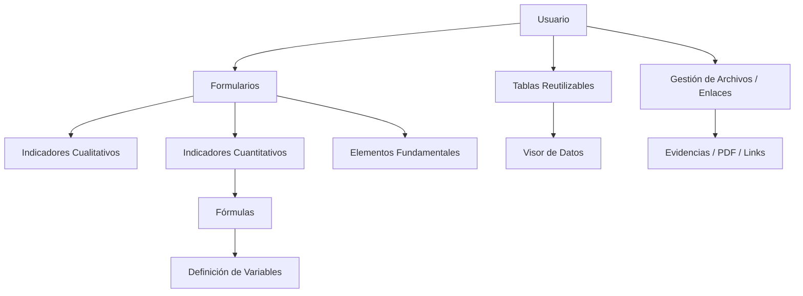
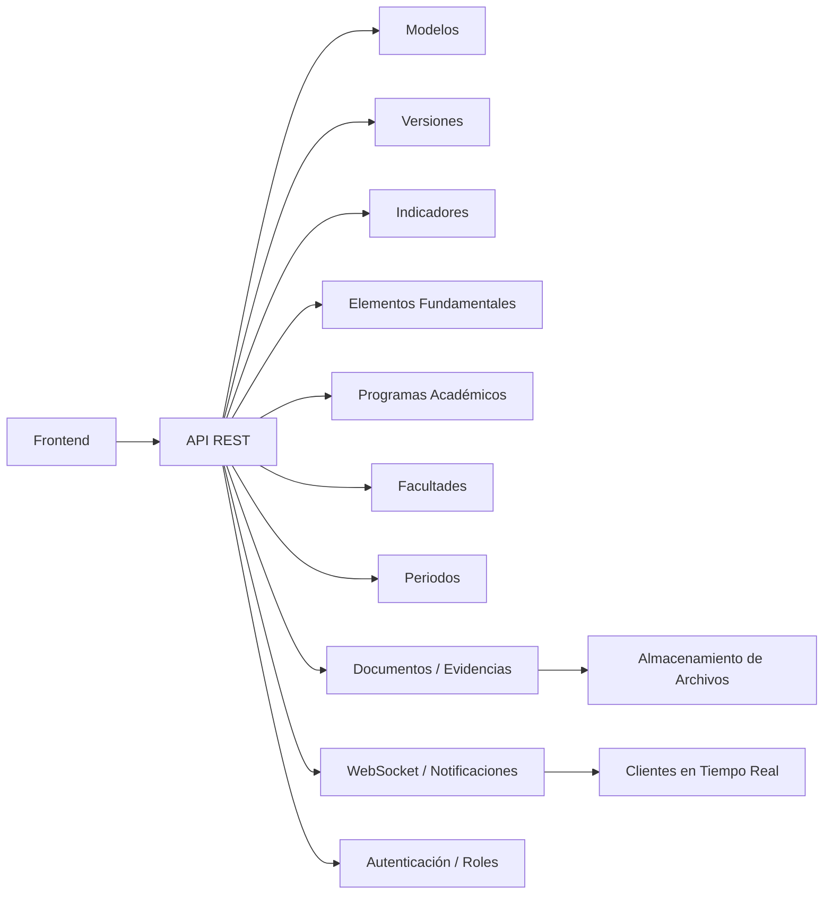

# Informe Ejecutivo

## 0. Objetivo del informe

Este documento resume el estado actual del proyecto `Administrador de Indicadores CACES`, presentando el avance en frontend y backend, los entregables clave, las brechas encontradas y los tiempos estimados para completar la solución.

---

## 1. Resumen ejecutivo

- El **frontend** está avanzado y cubre las funcionalidades principales para crear indicadores, modelos y fórmulas.
- El **backend** aún no se ha iniciado, por lo que su avance es actualmente **0%**.
- El trabajo restante en frontend está enfocado en gestionar entidades de soporte (facultades, periodos, programas académicos), la carga de evidencias y la interfaz de notificaciones.
- La decisión del **stack backend** es el punto crítico inmediato para poder avanzar en la persistencia y el flujo completo de datos.

---

## 2. Frontend

### 2.1 Avances clave

- **Tablas reutilizables:** se desarrolló un patrón de tablas que facilita el despliegue de datos en diferentes pantallas sin duplicar lógica.
- **Carga de información:** hay soporte para cargar documentos y enlaces, incluyendo evidencia en formato PDF y referencias externas.
- **Fórmulas de indicadores:** el módulo de creación de fórmulas está implementado y permite construir expresiones con variables definidas por el usuario.
- **Flujo de creación de modelos y versiones:** la estructura de rutas y formularios permite crear modelos con versiones asociadas y datos de contexto.
- **Validación sólida:** `zod` y `react-hook-form` garantizan que los formularios validen correctamente nombres, periodos, estándares y demás campos importantes.
- **Componentes UI modulares:** los elementos básicos de interfaz (botones, inputs, selects, tablas, tarjetas) están disponibles como bloques reutilizables.

### 2.2 Brechas y funcionalidades pendientes

- Administración de **facultades**.
- Gestión de **periodos académicos**.
- Configuración de **roles de usuario** y permisos.
- Creación de **programas académicos** y relación con indicadores.
- Carga y asociación de **evidencias de indicadores** al ciclo de evaluación.
- Procesos de **revisión y aprobación** de indicadores.
- Interfaz de **notificaciones** para alertas y actualizaciones en tiempo real.

### 2.3 Evaluación del avance

- Avance estimado: **70% - 80%**.
- Condición actual: la mayor parte de la lógica de presentación y captura de datos está lista.
- Riesgos frecuentes: sin un backend definido, hay limitaciones para completar la integración de evidencias y permisos.

### 2.4 Diagrama funcional frontend

---

## 3. Backend

### 3.1 Estado actual

- El backend está en etapa de análisis y definición.
- No se ha seleccionado la tecnología definitiva entre **Express** y **Spring Boot**.
- La base de datos aún no se ha definido aunque existe un diseño para MongoDB.

### 3.2 Funciones necesarias

- **CRUD** completo para:
  - Modelos.
  - Versiones.
  - Indicadores cuantitativos y cualitativos.
  - Elementos fundamentales.
  - Programas académicos.
  - Facultades.
  - Periodos.
- **Gestión de evidencias y documentos**.
- **Notificaciones en tiempo real** mediante WebSocket.
- **Autenticación y autorización** basada en roles.
- API REST para el consumo del frontend.

### 3.3 Prioridades de diseño

1. Definir el stack tecnológico y el esquema de datos.
2. Establecer la API REST.
3. Implementar la gestión de documentos y evidencias.
4. Agregar notificaciones en tiempo real.
5. Integrar seguridad y roles con el frontend.

### 3.4 Diagrama propuesto backend

### 3.5 Riesgos actuales

- La falta de definición de backend provoca dependencia en datos simulados o locales.
- El proyecto requiere un diseño de datos claro para evitar retrabajo en la integración.
- La implementación de notificaciones y evidencias depende de decisiones de almacenamiento.

---

## 4. Plan de trabajo y tiempos estimados

### 4.1 Tiempos por área

- **Frontend:** estimado en **7 días adicionales** para cerrar los módulos pendientes y completar la experiencia de usuario.
- **Backend:** estimado en **20 días** una vez definida la tecnología y el modelo de datos.

### 4.2 Siguientes entregables

1. Confirmar tecnología backend y base de datos.
2. Implementar roles y permisos en frontend y backend.
3. Completar el módulo de programas académicos y facultades.
4. Añadir carga de evidencias al ciclo de indicadores.
5. Construir UI de notificaciones.

### 4.3 Estrategia de prioridades

- Prioridad alta: definición de stack backend, permisos y API.
- Prioridad media: carga de evidencias, programas académicos y periodos.
- Prioridad baja: mejoras de UX adicionales y optimización de tablas.

---

## 5. Conclusión

El proyecto está bien encaminado en su capa de frontend, con un avance relevante en las funciones de creación de indicadores y modelos. El principal cuello de botella es la falta de backend definido, que impide la persistencia real, la seguridad y la comunicación en tiempo real.

> Con el frontend cerca del 80% completado, el foco inmediato debe ser: definir la arquitectura backend y avanzar con la integración de roles, evidencias y notificaciones.
