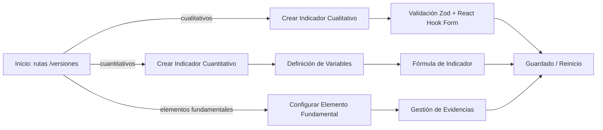
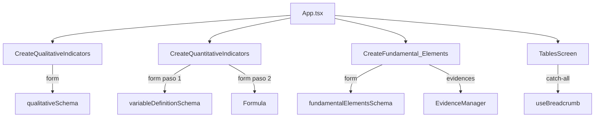

# Administrador de Indicadores CACES

Aplicación frontend construida con React, TypeScript y Vite para gestionar indicadores cualitativos, cuantitativos y elementos fundamentales en un flujo de datos estructurado.

## 📌 Descripción

Este proyecto permite crear y configurar indicadores en un contexto académico o institucional, con formularios avanzados, validación de datos y un flujo de navegación basado en rutas dinámicas.

## 🚀 Características principales

- Creación y edición de indicadores cualitativos.
- Configuración de indicadores cuantitativos con definición de variables y fórmulas.
- Gestión de elementos fundamentales con criterios de evaluación y evidencias.
- Navegación basada en rutas dinámicas específicas para versiones, modelos, criterios, subcriterios e indicadores.
- Validación de formularios con `zod` y `react-hook-form`.
- Interfaz responsiva con componentes reutilizables.

## 🧱 Tecnologías

- React 19
- TypeScript
- Vite
- Tailwind CSS
- React Router DOM
- Zustand
- React Hook Form
- Zod
- Math.js
- Lucide React

## 📁 Estructura relevante del proyecto

- `src/App.tsx` - Enrutamiento principal de la aplicación.
- `src/pages/` - Páginas principales de gestión:
  - `CreateQualitativeIndicators.tsx`
  - `CreateQuantitativeIndicators.tsx`
  - `CreateFundamental_Elements.tsx`
  - `TablesScreen.tsx`
- `src/components/` - Componentes UI y bloques reutilizables.
- `src/lib/validators/inputs.ts` - Esquemas de validación con Zod.
- `src/hooks/` - Hooks personalizados como `useBreadcrumb`, `useCreateIndicators` y `useCreateFundamental_Elements`.
- `src/types/DataTypes.ts` - Tipos compartidos de datos.

## 🌐 Rutas principales

La aplicación expone rutas dinámicas basadas en versiones, modelos, criterios y subcriterios.

> Para acceder correctamente a cualquiera de las pantallas de creación, la ruta debe comenzar con `/versiones`.

### Indicadores cualitativos

- `/versiones/:vId/modelos/:mId/criterios/:cId/subcriterios/:sId/indicadores/cualitativos/:newId`

### Indicadores cuantitativos

- `/versiones/:vId/modelos/:mId/criterios/:cId/subcriterios/:sId/indicadores/cuantitativos/:newId`

### Elementos fundamentales

- `/versiones/:vId/modelos/:mId/criterios/:cId/subcriterios/:sId/indicadores/:iId/elementos_fundamentales/:newId/configuracion_elementos_fundamentales`

### Pantalla genérica de tablas

- `/versiones/*`

## 🧪 Validación de formularios

Los formularios usan `zod` para validar datos sensibles. Algunos ejemplos de validaciones definidas en `src/lib/validators/inputs.ts`:

- `qualitativeSchema` - valida nombre, estándar, periodo y fuentes.
- `fundamentalElementsSchema` - valida descripciones de niveles de satisfacción y un campo de información adicional.
- `variableDefinitionSchema` - valida variables de indicadores cuantitativos y asegura que las variables de tipo selección tengan opciones.

## ⚙️ Cómo ejecutar

### Requisitos

- Node.js 20+ recomendado
- npm

### Instalación

```bash
npm install
```

### Modo desarrollo

```bash
npm run dev
```

### Compilar para producción

```bash
npm run build
```

### Previsualizar build

```bash
npm run preview
```

### Linting

```bash
npm run lint
```

## 🧩 Flujo general de la aplicación

### 1. Flujo de creación de indicadores cualitativos

1. El usuario accede a la ruta:
   - `/versiones/:vId/modelos/:mId/criterios/:cId/subcriterios/:sId/indicadores/cualitativos/:newId`
2. Se muestra un formulario para ingresar:
   - Nombre del indicador.
   - Estándar.
   - Periodo de evaluación.
   - Fuentes de información.
3. Los campos se validan en `onBlur` con `zod` y `react-hook-form`.
4. Al guardar, se dispara `createQualitativeIndicator(data)` y el formulario se reinicia.

### 2. Flujo de creación de indicadores cuantitativos

1. El usuario accede a la ruta:
   - `/versiones/:vId/modelos/:mId/criterios/:cId/subcriterios/:sId/indicadores/cuantitativos/:newId`
2. Paso 1: Definición de variables y metadata del indicador.
   - Se utiliza `QuantitativeIndicators_Form`.
   - Se ingresan nombre, estándar, periodo, fuentes y lineamientos de cálculo.
   - Se agregan variables tipo `standard` o `selection`.
   - Para variables de selección, se añaden opciones válidas.
3. Paso 2: construcción de fórmula.
   - Se muestra la pantalla `Formula` cuando el formulario inicial se completa.
   - El usuario escribe la expresión matemática basada en las variables definidas.
   - Al guardar, el flujo muestra un `console.log` con la información y una alerta de guardado.

### 3. Flujo de configuración de elementos fundamentales

1. El usuario accede a la ruta:
   - `/versiones/:vId/modelos/:mId/criterios/:cId/subcriterios/:sId/indicadores/:iId/elementos_fundamentales/:newId/configuracion_elementos_fundamentales`
2. Se muestra un formulario para ingresar:
   - Nombre del elemento fundamental.
   - Descripciones para los niveles: satisfactorio, cuasi satisfactorio, poco satisfactorio y deficiente.
   - Información adicional opcional.
3. La opción de evidencias es configurable con `EvidenceConfig`.
   - Si se habilita, se renderiza `EvidenceManager` para adjuntar archivos.
   - Se requiere al menos una evidencia si la opción está activa.
4. Al guardar, se ejecuta `createFundamentalElement(data, files, enabled)` y el formulario se reinicia.

### 4. Flujo de navegación y tablas

- `src/App.tsx` define las rutas principales y el manejo catch-all para `/versiones/*`.
- Cuando la ruta no coincide con los formularios específicos, se muestra `TablesScreen`.
- El breadcrumb interno (`useBreadcrumb`) usa la ruta actual para renderizar la navegación jerárquica.

## � Diagramas de flujo

### Flujo general de páginas



### Diagrama de rutas y componentes



## �💡 Notas importantes

- El guardado en la aplicación actualmente muestra alertas y realiza `console.log`; la persistencia real puede integrarse con una API o almacenamiento local.
- La ruta de tablas (`TablesScreen`) funciona como pantalla catch-all para rutas de versión.

## 📌 Recomendaciones futuras

- Agregar persistencia real con backend o almacenamiento en localStorage.
- Añadir gestión de usuarios y autenticación.
- Implementar edición de indicadores ya existentes.
- Añadir pruebas unitarias e integración.

---

Desarrollado como una herramienta para administrar indicadores de calidad, con énfasis en claridad de flujo y validación de datos.
